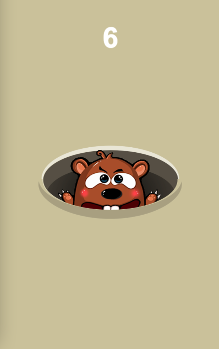

# Whac A Mole

采用 [evajs](https://github.com/eva-engine/eva.js) 游戏引擎开发的打地鼠游戏。

[Live Demo](https://codetyphon.github.io/eva-Whac-A-Mole/)

游戏素材源自[[https://github.com/jmariomejiap/whac-a-mole](https://github.com/jmariomejiap/whac-a-mole)

背景音效源自[Monkeys Spinning Monkeys](https://www.chosic.com/download-audio/?t=27247&tag=all)

>Monkeys Spinning Monkeys Kevin MacLeod (incompetech.com)
Licensed under Creative Commons: By Attribution 3.0 License
http://creativecommons.org/licenses/by/3.0/
Music promoted by https://www.chosic.com
